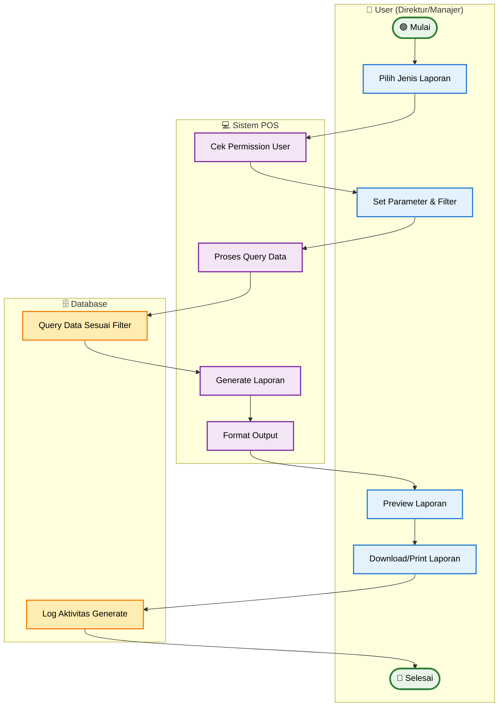

# Activity Diagram - Generate Laporan (Simplified)

## Penjelasan Activity Diagram (Simplified)

### 🎯 **Tujuan**
Menggambarkan alur utama generate laporan dengan fokus pada proses inti.

### 👥 **Swimlane Aktor**
- **👤 User (Direktur/Manajer)**: Pilih dan konfigurasi laporan
- **💻 Sistem POS**: Proses dan generate laporan
- **🗄️ Database**: Query data dan logging

### 🔄 **Jenis Laporan**
- **Laporan Penjualan**: Data transaksi dan revenue
- **Laporan Stok**: Status dan pergerakan stok
- **Laporan Return**: Data return dan alasan
- **Laporan Keuangan**: Analisa profit dan trend

### ✨ **Permission Level**
- **Direktur**: Akses semua cabang dan laporan
- **Manajer**: Akses cabang sendiri saja

### 📊 **Output**
- Laporan dalam format PDF/Excel
- Data sesuai filter dan permission
- Log aktivitas generate tercatat
