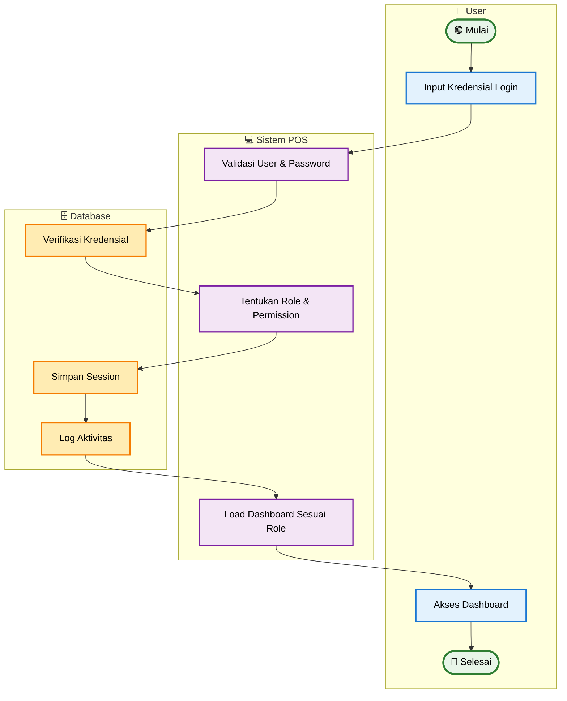

# Activity Diagram - Proses Login & Authorization (Simplified)

## Penjelasan Activity Diagram (Simplified)

### 🎯 **Tujuan**
Menggambarkan alur utama proses login dan authorization dengan fokus pada happy path.

### 👥 **Swimlane Aktor**
- **👤 User**: Input kredensial dan akses dashboard
- **💻 Sistem POS**: Validasi dan set permission
- **🗄️ Database**: Verifikasi dan logging

### 🔄 **Alur Utama**
1. **User**: Input username/password
2. **Sistem**: Validasi dan tentukan role/permission
3. **Database**: Verifikasi, simpan session, log aktivitas
4. **User**: Akses dashboard sesuai role

### ✨ **Role & Permission**
- **Direktur**: Full access semua cabang
- **Manajer**: Branch access dengan approval rights
- **Pegawai**: Limited access untuk transaksi

### 📊 **Output**
- Session aktif dengan permission yang sesuai
- Dashboard loaded sesuai role
- Aktivitas login tercatat
