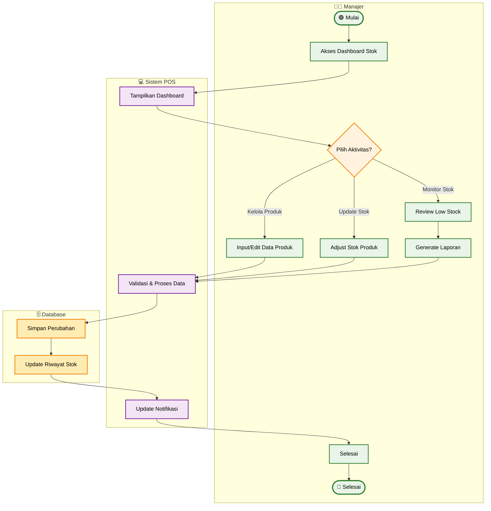

# Activity Diagram - Manajemen Stok Produk (Simplified)

## Penjelasan Activity Diagram (Simplified)

### 🎯 **Tujuan**
Menggambarkan alur utama manajemen stok produk dengan fokus pada aktivitas inti manajer.

### 👥 **Swimlane Aktor**
- **👨‍💼 Manajer**: Mengelola produk dan stok
- **💻 Sistem POS**: Validasi dan pemrosesan
- **🗄️ Database**: Penyimpanan data

### 🔄 **Aktivitas Utama**
1. **Kelola Produk**: Input/edit data produk baru atau existing
2. **Update Stok**: Adjust stok (tambah/kurangi/set manual)
3. **Monitor Stok**: Review low stock dan generate laporan

### ✨ **Simplifikasi yang Dilakukan**
- **Menggabungkan aktivitas serupa**: Semua jenis update stok dalam satu step
- **Fokus pada decision utama**: Pilihan aktivitas utama saja
- **Streamlined flow**: Linear flow untuk setiap path
- **Cleaner presentation**: Mudah dipahami untuk stakeholder

### 📊 **Output**
- Data produk dan stok terupdate
- Riwayat perubahan tercatat
- Notifikasi low stock terupdate
