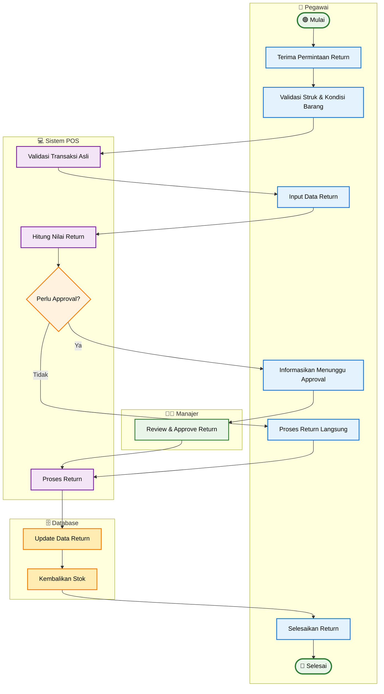

# Activity Diagram - Proses Return Barang (Simplified)

## Penjelasan Activity Diagram (Simplified)

### 🎯 **Tujuan**
Menggambarkan alur utama proses return barang dengan fokus pada langkah-langkah inti dan approval workflow.

### 👥 **Swimlane Aktor**
- **👤 Pegawai**: Interaksi dengan pelanggan dan input data
- **👨‍💼 Manajer**: Review dan approval return
- **💻 Sistem POS**: Validasi dan pemrosesan business logic
- **🗄️ Database**: Update data dan stok

### 🔄 **Alur Utama (Happy Path)**
1. **Pegawai**: Terima permintaan → Validasi struk & barang → Input data return
2. **Sistem**: Validasi transaksi asli → Hitung nilai return → Tentukan perlu approval
3. **Manajer**: Review dan approve (jika diperlukan)
4. **Database**: Update data return → Kembalikan stok

### ✨ **Simplifikasi yang Dilakukan**
- **Menggabungkan validasi**: Struk dan kondisi barang dalam satu step
- **Streamlined approval**: Fokus pada decision utama perlu approval atau tidak
- **Linear flow**: Menghilangkan multiple exception paths
- **Cleaner presentation**: Mudah dipahami untuk training dan SOP

### 📊 **Output**
- Return berhasil diproses
- Stok dikembalikan ke inventory
- Data return tercatat dengan benar
