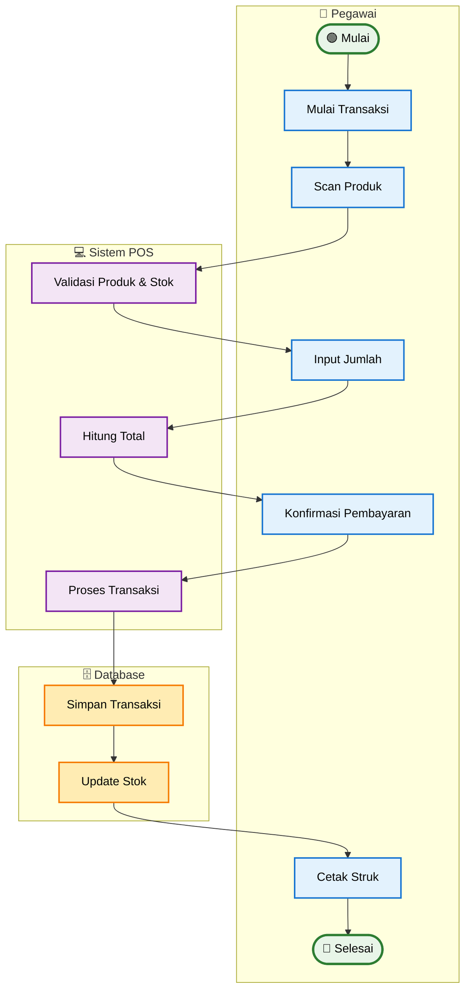

# Activity Diagram - Proses Transaksi Penjualan (Simplified)

## Penjelasan Activity Diagram (Simplified)

### 🎯 **Tujuan**
Menggambarkan alur utama proses transaksi penjualan dengan fokus pada langkah-langkah inti dan pemisahan tanggung jawab yang jelas.

### 👥 **Swimlane Aktor**
- **👤 Pegawai**: Interaksi langsung dengan pelanggan dan sistem
- **💻 Sistem POS**: Validasi dan pemrosesan business logic
- **🗄️ Database**: Penyimpanan dan update data

### 🔄 **Alur Utama (Happy Path)**
1. **Pegawai**: Mulai transaksi → Scan produk → Input jumlah → Konfirmasi pembayaran → Cetak struk
2. **Sistem**: Validasi produk & stok → Hitung total → Proses transaksi
3. **Database**: Simpan transaksi → Update stok

### ✨ **Simplifikasi yang Dilakukan**
- **Fokus pada alur utama**: Menghilangkan exception handling yang kompleks
- **Menggabungkan aktivitas terkait**: Validasi produk dan stok dalam satu step
- **Streamlined flow**: Linear flow tanpa loop yang rumit
- **Cleaner presentation**: Lebih mudah dipahami stakeholder non-teknis

### 📊 **Output**
- Transaksi berhasil diproses
- Data tersimpan dengan benar
- Struk tercetak untuk pelanggan
