# Class Diagram - Sistem POS UMKM (Standard UML Format)

```mermaid
classDiagram
    %% Core System Classes
    class User {
        -id
        -name
        -email
        -password
        -role
        -is_active
        -branch_id
        -email_verified_at
        -remember_token
        -created_at
        -updated_at
        --
        +isDirector
        +isManager
        +isEmployee
        +isActive
        +canManageUsers
        +canManageProducts
        +canProcessTransactions
        +scopeActive
        +scopeByRole
    }

    class Branch {
        -id
        -name
        -address
        -operational_area
        -phone
        -email
        -is_active
        -created_at
        -updated_at
        -deleted_at
        --
        +users
        +products
        +transactions
        +scopeActive
    }

    %% Product Management Classes
    class Category {
        -id
        -name
        -slug
        -description
        -is_active
        -created_at
        -updated_at
        -deleted_at
        --
        +products
        +scopeActive
    }

    class Product {
        -id
        -name
        -sku
        -category_id
        -description
        -image
        -base_price
        -stock
        -is_active
        -branch_id
        -created_at
        -updated_at
        -deleted_at
        --
        +category
        +branch
        +transactionItems
        +returnItems
        +scopeActive
        +scopeLowStock
    }

    %% Transaction Management Classes
    class Transaction {
        -id
        -invoice_number
        -branch_id
        -user_id
        -employee_id
        -customer_name
        -subtotal
        -discount_amount
        -total_amount
        -payment_method
        -status
        -notes
        -created_at
        -updated_at
        -deleted_at
        --
        +items
        +branch
        +employee
        +user
        +calculateTotal
        +scopeCompleted
    }

    class TransactionItem {
        -id
        -transaction_id
        -product_id
        -quantity
        -price
        -discount_percentage
        -discount_amount
        -subtotal
        -created_at
        -updated_at
        --
        +transaction
        +product
        +calculateSubtotal
    }

    %% Return Management Classes
    class ReturnTransaction {
        -id
        -return_number
        -original_transaction_id
        -branch_id
        -user_id
        -employee_id
        -manager_id
        -total_amount
        -reason
        -status
        -notes
        -approved_at
        -created_at
        -updated_at
        --
        +items
        +originalTransaction
        +branch
        +employee
        +manager
        +approve
        +reject
    }

    class ReturnItem {
        -id
        -return_transaction_id
        -product_id
        -quantity
        -price
        -subtotal
        -reason
        -condition
        -created_at
        -updated_at
        --
        +returnTransaction
        +product
        +calculateSubtotal
    }

    %% Relationships
    User --> Branch
    Branch --> User

    Category --> Product
    Product --> Category
    Branch --> Product
    Product --> Branch

    User --> Transaction
    Transaction --> User
    Branch --> Transaction
    Transaction --> Branch
    Transaction --> TransactionItem
    TransactionItem --> Transaction
    Product --> TransactionItem
    TransactionItem --> Product

    User --> ReturnTransaction
    ReturnTransaction --> User
    Branch --> ReturnTransaction
    ReturnTransaction --> Branch
    Transaction --> ReturnTransaction
    ReturnTransaction --> Transaction
    ReturnTransaction --> ReturnItem
    ReturnItem --> ReturnTransaction
    Product --> ReturnItem
    ReturnItem --> Product
```

## Penjelasan Class Diagram

Class Diagram ini menggambarkan struktur sistem POS UMKM dengan format standar UML yang terdiri dari:

### 1. Core System (Sistem Inti)
- **User**: Mengelola pengguna dengan role Direktur, Manajer, dan Pegawai
- **Branch**: Mengelola data cabang toko

### 2. Product Management (Manajemen Produk)
- **Category**: Mengelola kategori produk
- **Product**: Mengelola data produk dengan stok dan harga

### 3. Transaction Management (Manajemen Transaksi)
- **Transaction**: Mengelola transaksi penjualan
- **TransactionItem**: Mengelola detail item dalam transaksi

### 4. Return Management (Manajemen Return)
- **ReturnTransaction**: Mengelola transaksi return/retur
- **ReturnItem**: Mengelola detail item yang diretur

### Relasi Utama:
- Setiap User terhubung dengan Branch
- Product dikategorikan dalam Category dan terkait dengan Branch
- Transaction memiliki multiple TransactionItem
- ReturnTransaction dapat merujuk ke Transaction asli
- Semua entitas memiliki relasi yang jelas sesuai dengan business logic sistem POS
