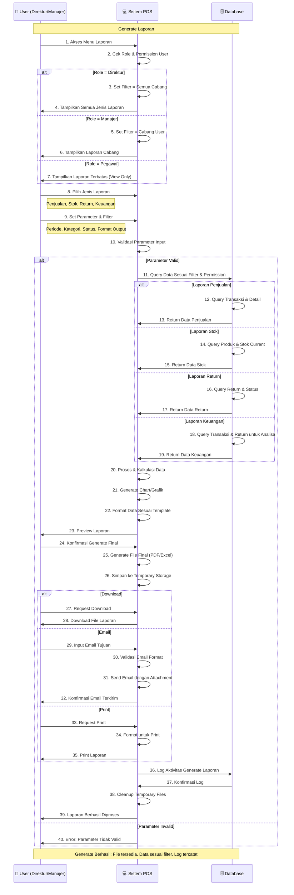

# Sequence Diagram - Generate Laporan

## Penjelasan Sequence Diagram

### 🎯 **Tujuan**
Menggambarkan interaksi antar komponen dalam proses generate laporan dengan role-based access dan berbagai jenis output.

### 👥 **Participants**
- **👤 User (Direktur/Manajer)**: User yang memiliki akses untuk generate laporan
- **💻 Sistem POS**: Aplikasi yang memproses logic reporting
- **🗄️ Database**: Penyimpanan data untuk berbagai jenis laporan

### 🔄 **Alur Interaksi**
1. **Access Control**: User akses menu → System cek role → Set permission filter
2. **Report Selection**: Pilih jenis laporan → Set parameter dan filter
3. **Data Processing**: Query database → Proses data → Generate chart/grafik
4. **Preview & Confirm**: Tampilkan preview → User konfirmasi → Generate final
5. **Output Delivery**: Download/Email/Print sesuai pilihan user
6. **Cleanup**: Log aktivitas → Cleanup temporary files

### ⚠️ **Role-based Access**
- **Direktur**: Akses semua cabang dan semua jenis laporan
- **Manajer**: Akses cabang sendiri dengan laporan lengkap
- **Pegawai**: Akses terbatas (view only) untuk laporan tertentu

### 📊 **Jenis Laporan**
- **Laporan Penjualan**: Data transaksi, revenue, trend penjualan
- **Laporan Stok**: Current stock, movement, low stock alerts
- **Laporan Return**: Return data, reasons, approval status
- **Laporan Keuangan**: Financial analysis, profit margin, net revenue

### 💾 **Database Queries**
- **Dynamic Filtering**: Query berdasarkan role, periode, dan parameter
- **Complex Joins**: Multiple table joins untuk comprehensive data
- **Aggregation**: Sum, count, average untuk statistical analysis
- **Performance Optimization**: Efficient queries untuk large datasets

### 📈 **Output Options**
- **Download**: PDF/Excel file untuk offline analysis
- **Email**: Send laporan via email dengan attachment
- **Print**: Direct printing untuk hard copy
- **Preview**: Online preview sebelum generate final

### 🔒 **Security & Audit**
- **Permission Filtering**: Data dibatasi sesuai role dan cabang
- **Activity Logging**: Semua generate activity tercatat
- **Temporary File Management**: Secure cleanup setelah delivery
- **Access Control**: Validasi permission di setiap step

### 📊 **Output**
- File laporan dalam format yang dipilih (PDF/Excel)
- Data yang akurat sesuai filter dan permission
- Chart dan grafik untuk visualisasi data
- Log aktivitas untuk audit trail
