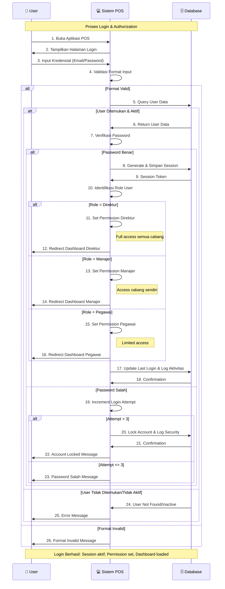

# Sequence Diagram - Proses Login & Authorization

## Penjelasan Sequence Diagram

### 🎯 **Tujuan**
Menggambarkan interaksi antar komponen sistem dalam proses login dan authorization dengan urutan waktu yang jelas.

### 👥 **Participants**
- **👤 User**: Pengguna sistem (Direktur/Manajer/Pegawai)
- **💻 Sistem POS**: Aplikasi POS yang memproses logic
- **🗄️ Database**: Penyimpanan data user dan session

### 🔄 **Alur Interaksi**
1. **Inisialisasi**: User buka aplikasi → System tampilkan login form
2. **Input Validation**: User input kredensial → System validasi format
3. **Authentication**: System query database → Verifikasi user & password
4. **Authorization**: System tentukan role → Set permission sesuai role
5. **Session Management**: Generate session token → Update last login
6. **Redirect**: User diarahkan ke dashboard sesuai role

### ⚠️ **Alternative Flows**
- **Format Invalid**: Validasi input gagal
- **User Not Found**: User tidak ada di database
- **Password Salah**: Password tidak match (dengan attempt counter)
- **Account Locked**: Terlalu banyak failed attempts
- **Role-based Redirect**: Dashboard berbeda per role

### 🔐 **Security Features**
- **Input Validation**: Format checking sebelum database query
- **Password Verification**: Secure password checking
- **Session Management**: Token-based session dengan database storage
- **Account Locking**: Protection dari brute force attacks
- **Audit Logging**: Pencatatan aktivitas login untuk security

### 📊 **Output**
- Session aktif dengan token yang valid
- Permission set sesuai dengan role user
- Dashboard loaded sesuai dengan authorization level
- Log aktivitas tercatat untuk audit trail
