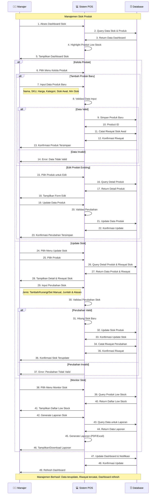

# Sequence Diagram - Manajemen Stok Produk

## Penjelasan Sequence Diagram

### 🎯 **Tujuan**
Menggambarkan interaksi antar komponen dalam proses manajemen stok produk dengan berbagai aktivitas CRUD dan monitoring.

### 👥 **Participants**
- **👨‍💼 Manajer**: User yang memiliki akses penuh untuk mengelola produk dan stok
- **💻 Sistem POS**: Aplikasi yang memproses logic manajemen stok
- **🗄️ Database**: Penyimpanan data produk, stok, dan riwayat perubahan

### 🔄 **Alur Interaksi**
1. **Dashboard Access**: Manajer akses dashboard → System query data → Tampilkan overview
2. **Product Management**: CRUD operations untuk data produk
3. **Stock Updates**: Adjust stok dengan berbagai jenis perubahan
4. **Stock Monitoring**: Review low stock dan generate laporan
5. **History Tracking**: Catat semua perubahan untuk audit trail

### ⚠️ **Alternative Flows**
- **Kelola Produk**: Tambah baru vs Edit existing
- **Update Stok**: Tambah/Kurangi/Set Manual dengan validasi
- **Monitor Stok**: Low stock alerts dan laporan
- **Data Validation**: Input validation dengan error handling

### 📊 **Stock Management Operations**
- **Tambah Produk**: Input data lengkap → Validasi → Simpan + riwayat awal
- **Edit Produk**: Query existing → Update → Konfirmasi
- **Update Stok**: Pilih produk → Input perubahan → Validasi → Update + riwayat
- **Monitor**: Query low stock → Generate laporan → Download/view

### 💾 **Database Interactions**
- **Dashboard Query**: Real-time data untuk overview dan alerts
- **Product CRUD**: Create, Read, Update operations untuk master data
- **Stock Updates**: Atomic updates dengan history tracking
- **Report Generation**: Complex queries untuk analisa dan laporan

### 📈 **Monitoring Features**
- **Low Stock Alerts**: Automatic highlighting produk dengan stok < minimum
- **Stock History**: Complete audit trail untuk semua perubahan stok
- **Report Generation**: PDF/Excel export untuk analisa dan planning
- **Dashboard Refresh**: Real-time updates untuk monitoring

### 📊 **Output**
- Data produk dan stok terupdate secara real-time
- Riwayat lengkap semua perubahan stok
- Dashboard dengan notifikasi low stock
- Laporan stok untuk analisa dan decision making
