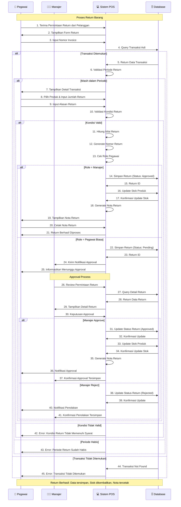

# Sequence Diagram - Proses Return Barang

## Penjelasan Sequence Diagram

### 🎯 **Tujuan**
Menggambarkan interaksi antar komponen dalam proses return barang dengan workflow approval berdasarkan role pengguna.

### 👥 **Participants**
- **👤 Pegawai**: Staff yang menerima dan memproses return dari pelanggan
- **👨‍💼 Manajer**: Supervisor yang melakukan approval untuk return
- **💻 Sistem POS**: Aplikasi yang memproses logic return dan approval
- **🗄️ Database**: Penyimpanan data transaksi, return, dan stok

### 🔄 **Alur Interaksi**
1. **Inisialisasi**: Pegawai terima permintaan → System tampilkan form return
2. **Validation**: Input invoice → Query transaksi asli → Validasi periode
3. **Return Input**: Pilih produk → Input jumlah & alasan → Validasi kondisi
4. **Role Check**: System cek role pegawai untuk menentukan approval flow
5. **Approval Flow**: Manajer langsung approve atau pegawai butuh approval
6. **Finalization**: Update stok → Generate nota → Notifikasi hasil

### ⚠️ **Alternative Flows**
- **Transaksi Tidak Ditemukan**: Invoice tidak ada di database
- **Periode Habis**: Return dilakukan setelah batas waktu
- **Kondisi Tidak Valid**: Barang tidak memenuhi syarat return
- **Role-based Flow**: Manajer vs Pegawai biasa
- **Approval Decision**: Approve vs Reject oleh manajer

### 🔐 **Role-based Workflow**
- **Manajer**: Dapat approve return langsung tanpa menunggu
- **Pegawai Biasa**: Harus menunggu approval dari manajer
- **Approval Process**: Notifikasi → Review → Decision → Update status

### 💾 **Database Interactions**
- **Query Transaksi**: Validasi invoice dan data transaksi asli
- **Simpan Return**: Save return data dengan status (Pending/Approved)
- **Update Status**: Change status berdasarkan approval decision
- **Update Stok**: Kembalikan stok jika return approved

### 📊 **Output**
- Data return tersimpan dengan status yang tepat
- Stok produk dikembalikan ke inventory (jika approved)
- Nota return untuk pelanggan
- Audit trail lengkap untuk approval process
