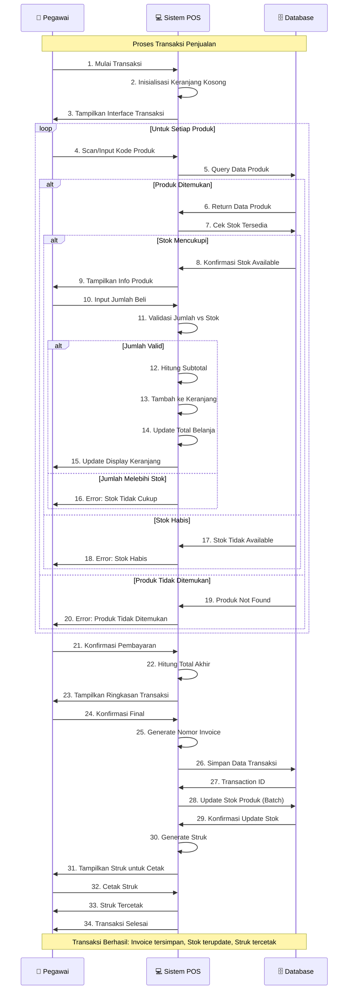

# Sequence Diagram - Proses Transaksi Penjualan

## Penjelasan Sequence Diagram

### 🎯 **Tujuan**
Menggambarkan interaksi antar komponen dalam proses transaksi penjualan dari mulai scan produk hingga cetak struk.

### 👥 **Participants**
- **👤 Pegawai**: Staff yang melayani pelanggan dan mengoperasikan sistem
- **💻 Sistem POS**: Aplikasi yang memproses logic transaksi
- **🗄️ Database**: Penyimpanan data produk, stok, dan transaksi

### 🔄 **Alur Interaksi**
1. **Inisialisasi**: Pegawai mulai transaksi → System setup keranjang kosong
2. **Product Loop**: Scan produk → Validasi → Tambah ke keranjang (repeat)
3. **Validation**: Cek ketersediaan produk dan stok di database
4. **Calculation**: Hitung subtotal per item dan total keseluruhan
5. **Finalization**: Konfirmasi pembayaran → Generate invoice → Simpan transaksi
6. **Stock Update**: Update stok produk secara batch
7. **Receipt**: Generate dan cetak struk untuk pelanggan

### ⚠️ **Alternative Flows**
- **Produk Tidak Ditemukan**: Scan kode yang tidak ada di database
- **Stok Habis**: Produk ada tapi stok = 0
- **Jumlah Melebihi Stok**: Input quantity > available stock
- **Validasi Error**: Input yang tidak valid

### 🔁 **Loop Behavior**
- **Product Loop**: Pegawai dapat scan multiple produk
- **Error Recovery**: Sistem memberikan feedback error dan allow retry
- **Cart Management**: Real-time update keranjang dan total

### 💾 **Database Interactions**
- **Query Produk**: Real-time product lookup
- **Cek Stok**: Validasi ketersediaan inventory
- **Simpan Transaksi**: Atomic transaction save
- **Update Stok**: Batch update untuk performance

### 📊 **Output**
- Transaksi tersimpan dengan nomor invoice unik
- Stok produk terupdate secara real-time
- Struk tercetak untuk pelanggan
- Keranjang direset untuk transaksi berikutnya
