# Use Case Diagram - Sistem POS UMKM (Business Analysis Layer)

```mermaid
graph TB
    %% Actors
    Direktur{{Direktur}}
    Manajer{{Manajer}}
    Pegawai{{Pegawai}}

    %% System Boundary
    subgraph POS[Sistem POS UMKM]
        %% Authentication & Access
        Login((Login ke Sistem))
        Logout((Keluar dari Sistem))
        
        %% Direktur Business Use Cases
        LaporanTerintegrasi((Lihat Laporan<br/>Seluruh Cabang))
        KelolaCabang((Kelola Data Cabang))
        KelolaUser((Kelola Pengguna<br/>Sistem))
        ExportData((Ekspor Laporan<br/>ke Excel/PDF))
        MonitorPerforma((Monitor Performa<br/>Cabang))
        
        %% Manajer Business Use Cases
        KelolaProduk((Kelola Stok Produk<br/>Hijab & Gamis))
        KelolaKategori((Kelola Kategori<br/>Produk Muslim))
        KelolaPegawai((Kelola Data Pegawai))
        ProsesReturn((Setujui/Tolak<br/>Retur Produk))
        LaporanCabang((Lihat Laporan<br/>Cabang))
        AturHarga((Atur Harga<br/>Produk))
        
        %% Pegawai Business Use Cases
        JualProduk((Jual Produk<br/>Baju Muslim))
        CetakStruk((Cetak Struk<br/>Penjualan))
        ProsesRetur((Proses Retur<br/>Barang Rusak))
        CariProduk((Cari Produk<br/>di Katalog))
        LihatStok((Lihat Stok<br/>Produk))
    end

    %% Actor Associations - Business Focus
    %% Direktur connections
    Direktur --- Login
    Direktur --- KelolaCabang
    Direktur --- KelolaUser
    Direktur --- LaporanTerintegrasi
    Direktur --- ExportData
    Direktur --- MonitorPerforma
    Direktur --- Logout

    %% Manajer connections
    Manajer --- Login
    Manajer --- KelolaProduk
    Manajer --- KelolaKategori
    Manajer --- KelolaPegawai
    Manajer --- ProsesReturn
    Manajer --- LaporanCabang
    Manajer --- AturHarga
    Manajer --- Logout

    %% Pegawai connections
    Pegawai --- Login
    Pegawai --- JualProduk
    Pegawai --- CetakStruk
    Pegawai --- ProsesRetur
    Pegawai --- CariProduk
    Pegawai --- LihatStok
    Pegawai --- Logout

    %% Business Relationships
    JualProduk -.->|include| CetakStruk
    ProsesReturn -.->|include| LaporanCabang

    %% Styling
    classDef actor fill:#e1f5fe,stroke:#01579b,stroke-width:2px
    classDef usecase fill:#f3e5f5,stroke:#4a148c,stroke-width:2px
    classDef system fill:#e8f5e8,stroke:#2e7d32,stroke-width:2px
    
    class Direktur,Manajer,Pegawai actor
    class Login,Logout,LaporanTerintegrasi,KelolaCabang,KelolaUser,ExportData,MonitorPerforma,KelolaProduk,KelolaKategori,KelolaPegawai,ProsesReturn,LaporanCabang,AturHarga,JualProduk,CetakStruk,ProsesRetur,CariProduk,LihatStok usecase
    class POS system
```

## Penjelasan Use Case Diagram (Business Analysis Layer)

### 🎯 **Fokus Bisnis**
Diagram ini menggambarkan proses bisnis yang dapat diamati oleh stakeholder toko baju muslim wanita, tanpa detail teknis implementasi.

### 👥 **Aktor Bisnis**
- **Direktur**: Mengelola seluruh operasional multi-cabang
- **Manajer**: Mengelola operasional cabang tertentu  
- **Pegawai**: Melayani pelanggan dan proses penjualan

### 🏪 **Proses Bisnis Utama**

#### **Direktur**
- Melihat laporan performa seluruh cabang
- Mengelola data cabang dan pengguna sistem
- Mengekspor laporan untuk analisis bisnis
- Memonitor performa setiap cabang

#### **Manajer**
- Mengelola stok produk hijab, gamis, dan mukena
- Mengatur kategori produk muslim
- Mengelola data pegawai cabang
- Menyetujui/menolak retur produk rusak
- Melihat laporan penjualan cabang
- Mengatur harga produk

#### **Pegawai**
- Melayani penjualan produk baju muslim
- Mencetak struk untuk pelanggan
- Memproses retur barang rusak
- Mencari produk dalam katalog
- Mengecek stok produk tersedia

### 🔄 **Hubungan Bisnis**
- Setiap penjualan otomatis menghasilkan struk
- Proses retur mempengaruhi laporan cabang
- Semua aktor harus login untuk mengakses sistem
