# Sequence Diagram - Generate Laporan (Simplified)

```mermaid
sequenceDiagram
    participant D as 👤 Direktur;
    participant U as 🖥️ UI;
    participant C as 🌐 Controller;
    participant DB as 🗄️ Database;

    Note over D,DB: Generate Laporan;

    D->>U: 1. Akses Menu Laporan;
    activate U
    U->>C: :order(akses_menu_laporan);
    activate C
    C->>DB: :order(cek_role_permission);
    activate DB
    DB-->>C: :order(data_role);
    deactivate DB
    C-->>U: :order(menu_laporan);
    deactivate C
    U-->>D: :order(tampilkan_menu);
    deactivate U

    D->>U: 2. Pilih Jenis Laporan;
    activate U
    U->>C: :order(pilih_jenis_laporan, tipe_laporan);
    activate C
    C-->>U: :order(form_filter);
    deactivate C
    U-->>D: :order(tampilkan_form);
    deactivate U

    D->>U: 3. Generate Laporan;
    activate U
    U->>C: :order(generate_laporan, filter, periode);
    activate C
    C->>DB: :order(ambil_data_laporan);
    activate DB
    DB-->>C: :order(data_laporan);
    deactivate DB
    C-->>U: :order(laporan_siap);
    deactivate C
    U-->>D: :order(tampilkan_download);
    deactivate U

    Note right of D: Implementasi Laravel:<br/>ReportController<br/>Transaction Model<br/>Product Model<br/>Export Libraries;
```

## Penjelasan Sequence Diagram

### 🎯 **Tujuan**
Menggambarkan interaksi sederhana antar komponen dalam proses generate laporan dengan format 1 actor + 3 objects.

### 👥 **Participants**
- **👤 Direktur**: Actor yang mengakses laporan (bisa juga Manajer)
- **🖥️ UI**: Interface pengguna (Blade templates)
- **🌐 Controller**: ReportController Laravel
- **🗄️ Database**: MySQL database

### 🔄 **Alur Proses**
1. **Akses Menu Laporan**: Direktur membuka menu laporan
2. **Pilih Jenis Laporan**: Memilih tipe laporan dan filter
3. **Generate Laporan**: Sistem menghasilkan laporan sesuai filter

### 💻 **Implementasi Teknis**
- **Laravel Routes**: GET/POST /reports/*
- **Controller**: ReportController
- **Models**: Transaction, Product, User, Branch
- **Export**: Excel/PDF export libraries
- **Views**: Blade templates untuk UI
- **Database**: MySQL operations dengan complex queries
