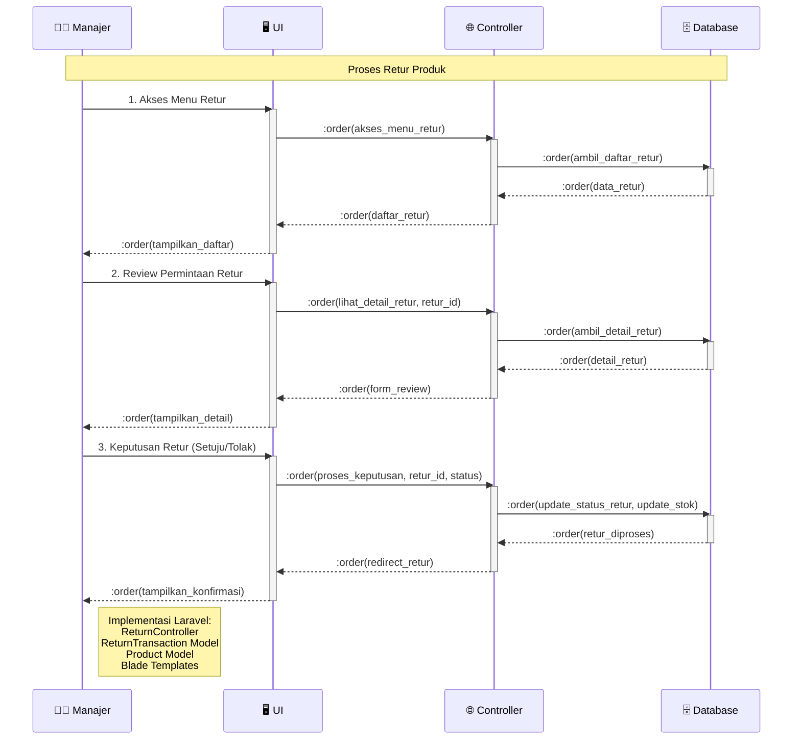

# Sequence Diagram - Proses Retur (Simplified)

## Penjelasan Sequence Diagram

### 🎯 **Tujuan**
Menggambarkan interaksi sederhana antar komponen dalam proses retur produk dengan format 1 actor + 3 objects.

### 👥 **Participants**
- **👨‍💼 Manajer**: Actor yang mengelola proses retur
- **🖥️ UI**: Interface pengguna (Blade templates)
- **🌐 Controller**: ReturnController Laravel
- **🗄️ Database**: MySQL database

### 🔄 **Alur Proses**
1. **Akses Menu Retur**: Manajer melihat daftar permintaan retur
2. **Review Permintaan**: Melihat detail retur yang diajukan
3. **Keputusan Retur**: Menyetujui atau menolak retur

### 💻 **Implementasi Teknis**
- **Laravel Routes**: GET/POST /returns/*
- **Controller**: ReturnController
- **Models**: ReturnTransaction, Product, Transaction
- **Views**: Blade templates untuk UI
- **Database**: MySQL operations untuk update status dan stok
