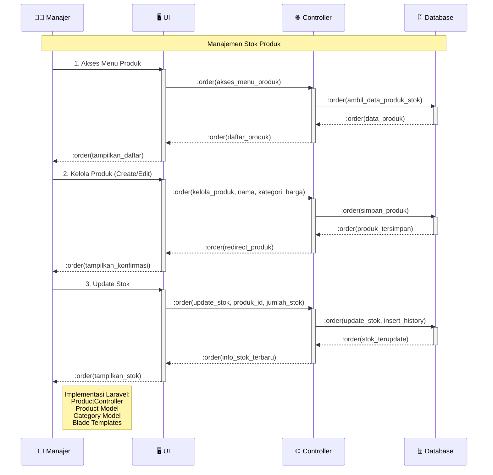

# Sequence Diagram - Manajemen Stok (Simplified)

## Penjelasan Sequence Diagram

### 🎯 **Tujuan**
Menggambarkan interaksi sederhana antar komponen dalam manajemen stok produk dengan format 1 actor + 3 objects.

### 👥 **Participants**
- **👨‍💼 Manajer**: Actor yang mengelola produk dan stok
- **🖥️ UI**: Interface pengguna (Blade templates)
- **🌐 Controller**: ProductController Laravel
- **🗄️ Database**: MySQL database

### 🔄 **Alur Proses**
1. **Akses Menu Produk**: Manajer melihat daftar produk dan stok
2. **Kelola Produk**: Menambah atau mengedit produk
3. **Update Stok**: Mengubah jumlah stok produk

### 💻 **Implementasi Teknis**
- **Laravel Routes**: GET/POST /products/*
- **Controller**: ProductController
- **Models**: Product, Category, StockHistory
- **Views**: Blade templates untuk UI
- **Database**: MySQL operations untuk CRUD produk dan stok
