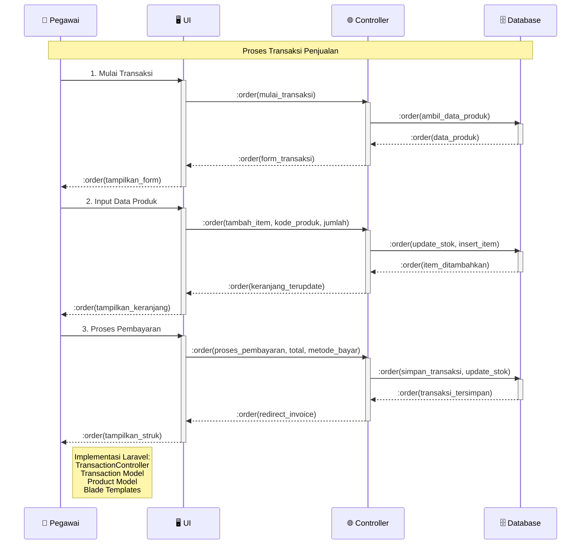

# Sequence Diagram - Proses Transaksi (Simplified)

## Penjelasan Sequence Diagram

### 🎯 **Tujuan**
Menggambarkan interaksi sederhana antar komponen dalam proses transaksi penjualan dengan format 1 actor + 3 objects.

### 👥 **Participants**
- **👤 Pegawai**: Actor yang melakukan transaksi
- **🖥️ UI**: Interface pengguna (Blade templates)
- **🌐 Controller**: TransactionController Laravel
- **🗄️ Database**: MySQL database

### 🔄 **Alur Proses**
1. **Mulai Transaksi**: Pegawai mengakses form transaksi
2. **Input Data Produk**: Menambahkan item ke keranjang
3. **Proses Pembayaran**: Finalisasi transaksi dan cetak struk

### 💻 **Implementasi Teknis**
- **Laravel Routes**: POST /transactions/*
- **Controller**: TransactionController
- **Models**: Transaction, Product, TransactionItem
- **Views**: Blade templates untuk UI
- **Database**: MySQL operations dengan transactions
